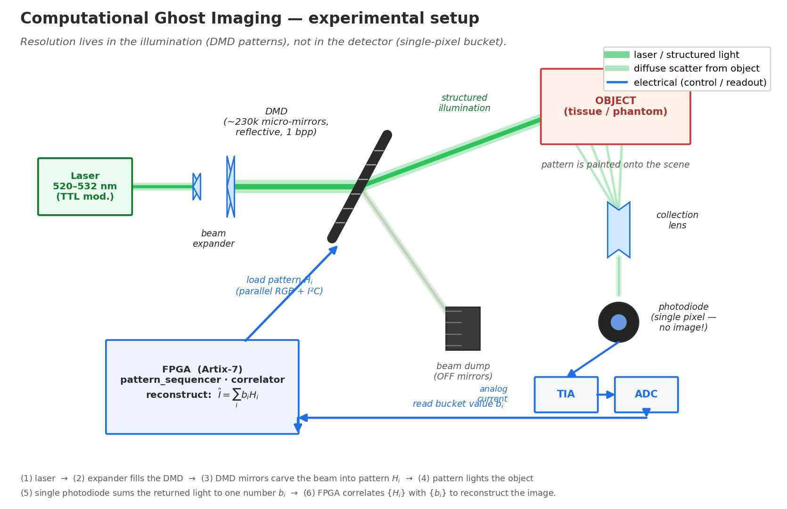

# Ghost Imager

An FPGA-based computational ghost imaging system built on the Nexys Video Artix-7 board. Part of a broader instrumentation platform alongside [Ramsey](https://github.com/), an FPGA-based quantum defect sensor readout system for NV centers and SiC point defects.

---

## Overview

Ghost imaging reconstructs a spatial image of an object using a single-pixel (bucket) detector that has no spatial resolution. Instead of a camera, structured light patterns are projected onto the object sequentially. The integrated intensity response at the bucket detector, correlated with the known patterns, is sufficient to reconstruct the image.

This project implements **computational ghost imaging (CGI)** — the practically accessible variant where the patterns are known a priori (no entangled photons required), enabling deterministic FPGA-driven acquisition and on-chip reconstruction.

### Experimental setup



The laser beam is expanded to fill the **DMD**, a chip of ~230,000 micro-mirrors. Each mirror tilts independently: "ON" mirrors reflect their part of the beam toward the object, "OFF" mirrors dump theirs into a beam dump — so a flat beam leaves the DMD carved into a known pattern *Hᵢ*. That pattern lights the object; the diffusely scattered light is collected onto a **single-pixel photodiode** (no imaging optics — it reports one number *bᵢ* per pattern). The **FPGA** closes the loop: it loads each pattern into the DMD and reads back each bucket value, then reconstructs the image by correlating the two, `Î = Σ bᵢ Hᵢ`. The spatial resolution lives entirely in the *illumination patterns*, not in the detector — which is why a one-pixel sensor that works in NIR and through scattering tissue can replace a camera.

The figure is generated by [`sw/setup_figure.py`](sw/setup_figure.py) (`python sw/setup_figure.py`).

---

## Why FPGA

A PC-based CGI system works but sacrifices deterministic timing. The FPGA provides:

- **Sub-microsecond synchronization** between DMD pattern transitions and ADC sampling — no OS jitter
- **On-chip correlation accumulation** in BRAM — reconstruction is complete the moment acquisition ends
- **Pipelined acquisition** — continuous pattern-project / sample / accumulate loop at full DMD rate
- **Integration with Ramsey** — shared timing sequencer, SPI bus, and optical frontend enables future dual-modality operation (optical imaging + magnetic field sensing in the same volume)

---

## System Architecture

```
FPGA (Nexys Video Artix-7)
│
├── Pattern Sequencer FSM
│     └── Steps through Hadamard / random patterns stored in BRAM
│           └── Fires trigger to DMD, waits settling time, gates ADC sample
│
├── DMD Interface
│     └── I2C register config + parallel RGB888 video timing to DLPDLCR2000EVM (LightCrafter Display 2000)
│
├── Bucket Detector Chain
│     └── FDS100 photodiode → OPA657 TIA → on-chip XADC (integration in progress)
│
├── Correlation Accumulator
│     └── Fixed-point MAC: running sum of b_i * H_i per pixel, stored in BRAM
│
└── UART Streaming
      └── Partial sums streamed to PC for live preview during acquisition
```

---

## Hardware

| Component | Part | Notes |
|---|---|---|
| FPGA board | Digilent Nexys Video Artix-7 | Shared with Ramsey |
| DMD | TI `DLPDLCR2000EVM` (LightCrafter Display 2000) | $119, Mouser. I2C config + parallel RGB888 video |
| Light source | 532 nm DPSS laser module (TTL mod) | Shared with Ramsey optical frontend; NIR pair added in Phase 2 |
| Detector | FDS100 PIN photodiode + OPA657 DIY TIA | APD dropped — see [shopping-list.md](docs/shopping-list.md) decision log |
| ADC | On-chip XADC (Artix-7), single VAUX channel | Integration mode for CGI bucket signal; integration in progress |

The detector frontend is designed to serve both CGI (linear integration mode) and Ramsey (photon counting mode) from the same hardware.

---

## Reconstruction

**Phase 1 — correlation sum (simple, always works):**

$$\hat{I} = \sum_{i=1}^{N} b_i H_i$$

Where $b_i$ is the bucket intensity for pattern $i$ and $H_i$ is the known pattern matrix.

**Phase 2 — Hadamard basis:**

Random patterns require O(N) measurements for N pixels. Hadamard patterns with differential measurement reduce noise and can reconstruct from fewer measurements.

**Phase 3 — compressed sensing (OMP):**

With structured sparsity assumptions, reconstruct from M << N measurements. Reconstruction runs on PC (Python / numpy) initially; candidate for partial FPGA acceleration later.

---

## Build Roadmap

- [x] **Phase 1** — DMD controller: I2C register config (`dmd_init`) + parallel video timing (`dmd_video_if`), built on `i2c_master`, wired into `top.sv`
- [ ] **Phase 2** — ADC readout: `xadc_interface` built and cocotb-tested standalone; not yet wired into `top.sv` or synced with the acquisition loop
- [x] **Phase 3** — Pattern + sample synchronizer: `pattern_sequencer` FSM built, tested, integrated
- [x] **Phase 4** — BRAM accumulator: `correlator` on-chip correlation sum, built, tested, integrated (bit-exact against a numpy reference in the Hadamard integration test)
- [x] **Phase 5** — UART streaming: `uart_streamer` + `csr_handler` + `uart_interface`, built, tested, integrated with TX arbitration in `top.sv`
- [ ] **Phase 6** — Hadamard basis (working end-to-end, see `test_hadamard_8x8`) + differential ghost imaging (not yet started)
- [ ] **Phase 7** — Compressed sensing reconstruction (PC-side, Python)
- [ ] **Phase 8** — Scaling toward thermal GI and eventual quantum GI

---

## Relation to Ramsey

Ghost Imager and Ramsey share:

- **FPGA board** — Nexys Video Artix-7
- **Optical frontend** — same photodiode + OPA657 TIA and 532 nm laser (Ramsey adds an APD for its photon-counting path)
- **Serial bus conventions** — I2C/SPI transport primitives kept library-friendly across projects (Ramsey's ADF4351 MW source and APD bias controller on SPI; Ghost Imager's DMD on I2C)
- **Timing sequencer pattern** — pulse gating FSM structure is directly analogous
- **Shared RTL primitives** — SPI master, UART controller, ADC interface live in [`fpga-instruments-lib`](https://github.com/)

The long-term integration goal is a dual-modality sensor: ghost imaging for optical scene reconstruction through scattering media, combined with NV magnetometry for simultaneous magnetic field mapping of the same volume. Target application: underwater sensing.

---

## Repository Structure

```
ghost-imager/
├── rtl/
│   ├── top.sv                  synthesizable top
│   ├── pattern_sequencer.sv
│   ├── correlator.sv
│   ├── uart_streamer.sv
│   ├── uart/                   uart_tx, uart_rx, uart_top, uart_interface
│   ├── csr/                    csr_handler
│   ├── i2c/                    i2c_master
│   ├── dmd/                    dmd_init, dmd_video_if
│   ├── xadc/                   xadc_interface
│   └── lib/                    cdc_sync, bram_dp
├── ip/
│   └── xadc_wiz_0/              generated XADC Wizard IP (scripts/gen_xadc_ip.tcl)
├── constraints/
│   └── nexys_video.xdc
├── sim/cocotb/                  mirrors rtl/ structure, one dir per module
├── scripts/
│   ├── build.tcl                 non-project Vivado batch build
│   └── gen_xadc_ip.tcl           generates ip/xadc_wiz_0/
├── sw/
│   └── reconstruct.py            PC-side reconstruction + preview
├── docs/
│   └── architecture.md
└── README.md
```

---

## Related Projects

- **[Ramsey](https://github.com/)** — FPGA-based quantum defect sensor readout (NV centers, SiC point defects)
- **[fpga-instruments-lib](https://github.com/)** — Shared RTL primitives (SPI, UART, TDC, ADC interface)

---

## References

- Shapiro, J. H. (2008). Computational ghost imaging. *Physical Review A*, 78(6).
- Bromberg, Y. et al. (2009). Ghost imaging with a single detector. *Physical Review A*, 79(5).
- Duarte, M. F. et al. (2008). Single-pixel imaging via compressive sampling. *IEEE Signal Processing Magazine*.
- Degen, C. L. et al. (2017). Quantum sensing. *Reviews of Modern Physics*, 89(3).
